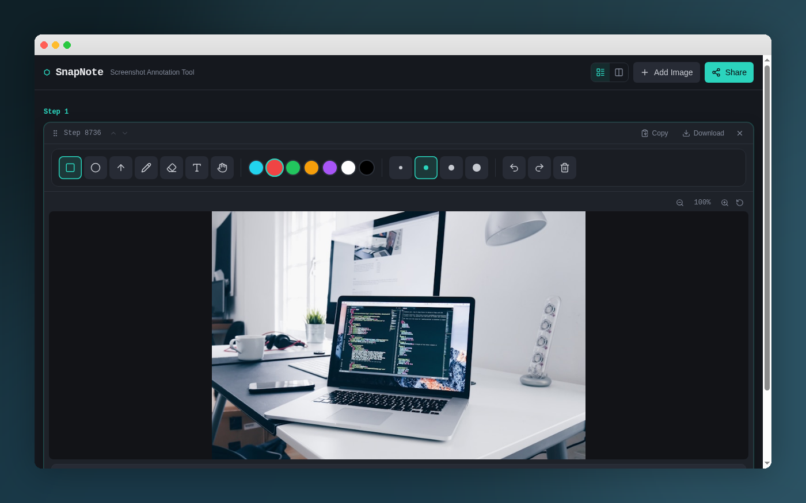

<p align="center">
  
</p>

<h1 align="center">SnapNote</h1>

<p align="center">
  <strong>Screenshot Annotation & Sharing Tool</strong>
</p>

<p align="center">
  <a href="https://github.com/naimurhasan/PastePath/stargazers">
    
  </a>
  <a href="https://github.com/naimurhasan/PastePath/blob/main/LICENSE">
    
  </a>
  <a href="https://draw-annotate-share.lovable.app">
    
  </a>
</p>

<p align="center">
  Drop screenshots, annotate with shapes, arrows, text & freehand, then share with a single link.
</p>

---

<p align="center">
  
</p>

---

## ✨ Features

| Feature | Description |
|---------|-------------|
| 🖼️ **Multi-image steps** | Add multiple screenshots as ordered steps |
| ✏️ **Rich annotation tools** | Rectangle, circle, arrow, pencil, eraser, and text |
| 🔤 **Unicode text** | Full emoji & multilingual text support (CJK, Devanagari, etc.) |
| 🎨 **Color & size** | 8 preset colors, 4 stroke sizes, keyboard shortcuts |
| 🔍 **Zoom & pan** | Zoom in/out with hand tool; mouse wheel support |
| ↕️ **Reorder steps** | Move steps up/down to rearrange your guide |
| 📋 **Captions** | Add multiline captions per step |
| 🔗 **One-click sharing** | Generate a shareable link with optional password protection |
| 📥 **Export** | Copy to clipboard or download annotated images |
| 🌙 **Dark UI** | Sleek dark theme by default |

## 🚀 Quick Start

```bash
# Clone the repo
git clone https://github.com/naimurhasan/PastePath.git
cd draw-annotate-share

# Install dependencies
npm install

# Start dev server
npm run dev
```

Open [http://localhost:5173](http://localhost:5173) in your browser.

## 🛠️ Tech Stack

- **React 18** + **TypeScript**
- **Vite** — blazing-fast dev & build
- **Tailwind CSS** — utility-first styling
- **shadcn/ui** — accessible, composable components
- **Lovable Cloud** — backend for sharing & persistence
- **Canvas API** — high-resolution annotation rendering

## ⌨️ Keyboard Shortcuts

| Key | Action |
|-----|--------|
| `1` | Rectangle tool |
| `2` | Circle tool |
| `3` | Arrow tool |
| `4` | Pencil (freehand) |
| `5` | Eraser |
| `6` | Text tool |
| `7` | Hand (pan & zoom) |
| `Ctrl+Z` | Undo |
| `Ctrl+Y` | Redo |

## 📁 Project Structure

```
src/
├── components/
│   ├── AnnotationCanvas.tsx   # Canvas rendering & drawing logic
│   ├── AnnotationToolbar.tsx  # Tool, color & size selection
│   ├── CaptionInput.tsx       # Step captions
│   ├── ImagePanel.tsx         # Per-step panel with toolbar & canvas
│   ├── ImageUploader.tsx      # Drag-drop, paste, URL image input
│   ├── ShareDialog.tsx        # Share link generation
│   └── ui/                    # shadcn/ui primitives
├── pages/
│   ├── Index.tsx              # Main editor page
│   └── ViewShare.tsx          # Shared link viewer
├── types/
│   └── annotation.ts          # TypeScript types
└── integrations/
    └── supabase/              # Backend client & types
```

## 🤝 Contributing

Contributions are welcome! Feel free to open issues or submit pull requests.

1. Fork the repo
2. Create your feature branch (`git checkout -b feature/awesome`)
3. Commit changes (`git commit -m 'Add awesome feature'`)
4. Push to branch (`git push origin feature/awesome`)
5. Open a Pull Request

## ⭐ Star History

If you find this project useful, please consider giving it a ⭐ on GitHub!

[](https://github.com/naimurhasan/PastePath)

---

<p align="center">
  Built with ❤️ using <a href="https://lovable.dev">Lovable</a>
</p>
